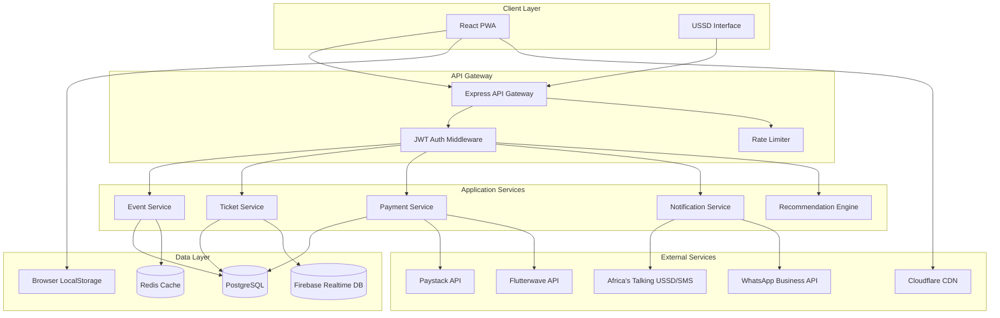

# Tikit Web Application Design Document

## Overview

Tikit is a progressive web application (PWA) designed to democratize event ticketing in Nigeria by addressing the unique challenges of the Nigerian market including limited internet connectivity, diverse payment methods, and cultural event requirements. The system architecture prioritizes offline-first capabilities, USSD integration for feature phones, and real-time synchronization.

The application follows a modern web architecture with a React-based frontend, Node.js/Express backend, Firebase for real-time features, and PostgreSQL for transactional data. The design emphasizes progressive enhancement, ensuring core functionality works on 2G networks while providing enhanced experiences on faster connections.

## Architecture

### High-Level Architecture



### Technology Stack

**Frontend:**
- React 18 with TypeScript
- Vite for build tooling
- TanStack Query for server state management
- Zustand for client state management
- Tailwind CSS for styling
- Workbox for service worker and offline capabilities
- i18next for internationalization
- React Hook Form for form management
- Zod for validation

**Backend:**
- Node.js 20 LTS
- Express.js for API framework
- TypeScript for type safety
- Prisma ORM for database access
- PostgreSQL 15 for primary database
- Redis 7 for caching and session management
- Firebase Realtime Database for live updates
- Bull for job queues

**Infrastructure:**
- Vercel for frontend hosting
- Railway/Render for backend hosting
- Cloudflare for CDN and DDoS protection
- Firebase for real-time features
- GitHub Actions for CI/CD

## Components and Interfaces

### Frontend Components

#### 1. Onboarding Module
- **LanguageSelector**: Displays language options with flag icons
- **StateSelector**: Searchable dropdown with all Nigerian states
- **OnboardingFlow**: Wizard component managing multi-step onboarding

#### 2. Event Discovery Module
- **EventFeed**: Infinite scroll list with lazy loading
- **EventCard**: Displays event summary with image, title, date, price
- **FilterPanel**: Multi-select filters with real-time updates
- **EventDetailPage**: Full event information with ticket purchase CTA
- **MapView**: Geographic visualization of nearby events

#### 3. Ticket Purchase Module
- **TicketSelector**: Tier selection with quantity controls
- **PaymentMethodSelector**: Radio group for payment options
- **InstallmentCalculator**: Shows payment schedule
- **GroupBuyCreator**: Interface for initiating group purchases
- **PaymentConfirmation**: Success/failure feedback with ticket display

#### 4. Offline Wallet Module
- **TicketWallet**: Grid/list view of purchased tickets
- **QRCodeDisplay**: Full-screen QR code for scanning
- **TicketShare**: WhatsApp share functionality
- **SyncIndicator**: Shows online/offline status and sync state

#### 5. Organizer Dashboard Module
- **EventCreator**: Form with template selection
- **AnalyticsDashboard**: Charts showing sales, revenue, demographics
- **AttendeeList**: Searchable table with export functionality
- **BroadcastComposer**: WhatsApp message composer
- **TicketScanner**: QR code scanner interface

#### 6. User Profile Module
- **ProfileSettings**: Language, state, notification preferences
- **ReferralCenter**: Referral code display and leaderboard
- **WalletBalance**: Shows credits and transaction history
- **PurchaseHistory**: List of past ticket purchases

### Backend API Endpoints

#### Authentication
- `POST /api/auth/register` - Register new user with phone OTP
- `POST /api/auth/login` - Login with phone and password
- `POST /api/auth/verify-otp` - Verify OTP code
- `POST /api/auth/refresh` - Refresh JWT token
- `POST /api/auth/logout` - Invalidate session

#### Events
- `GET /api/events` - List events with filters and pagination
- `GET /api/events/:id` - Get event details
- `POST /api/events` - Create new event (organizer only)
- `PUT /api/events/:id` - Update event (organizer only)
- `DELETE /api/events/:id` - Delete event (organizer only)
- `GET /api/events/:id/analytics` - Get event analytics
- `POST /api/events/:id/validate-code` - Validate hidden event code

#### Tickets
- `POST /api/tickets/purchase` - Purchase tickets
- `GET /api/tickets/my-tickets` - Get user's tickets
- `GET /api/tickets/:id` - Get ticket details
- `POST /api/tickets/verify` - Verify ticket QR code
- `POST /api/tickets/bulk-purchase` - Bulk ticket purchase
- `POST /api/tickets/group-buy/initiate` - Start group buy
- `GET /api/tickets/group-buy/:id/status` - Check group buy status

#### Payments
- `POST /api/payments/initialize` - Initialize payment
- `POST /api/payments/verify` - Verify payment callback
- `POST /api/payments/installment/schedule` - Create installment plan
- `POST /api/payments/sponsor/request` - Request sponsorship
- `POST /api/payments/sponsor/approve` - Approve sponsorship

#### USSD
- `POST /api/ussd/callback` - Handle USSD session callbacks
- `GET /api/ussd/events/:code` - Get event by USSD code

#### Recommendations
- `GET /api/recommendations/feed` - Get personalized event feed
- `POST /api/recommendations/track` - Track user interaction

#### Referrals
- `GET /api/referrals/code` - Get user's referral code
- `POST /api/referrals/apply` - Apply referral code
- `GET /api/referrals/leaderboard` - Get referral leaderboard
- `GET /api/referrals/earnings` - Get referral earnings

#### Notifications
- `POST /api/notifications/broadcast` - Send broadcast to attendees
- `GET /api/notifications/preferences` - Get notification settings
- `PUT /api/notifications/preferences` - Update notification settings

## Data Models

### User
```typescript
interface User {
  id: string;
  phoneNumber: string;
  phoneVerified: boolean;
  email?: string;
  firstName?: string;
  lastName?: string;
  preferredLanguage: 'en' | 'ha' | 'ig' | 'yo' | 'pcm';
  state: string;
  lga?: string;
  role: 'attendee' | 'organizer' | 'admin';
  walletBalance: number;
  referralCode: string;
  referredBy?: string;
  createdAt: Date;
  updatedAt: Date;
}
```

### Event
```typescript
interface Event {
  id: string;
  organizerId: string;
  title: string;
  description: string;
  eventType: 'wedding' | 'crusade' | 'burial' | 'festival' | 'general';
  startDate: Date;
  endDate: Date;
  venue: string;
  state: string;
  lga: string;
  latitude: number;
  longitude: number;
  isHidden: boolean;
  accessCode?: string;
  deepLink?: string;
  capacity: number;
  ticketsSold: number;
  tiers: TicketTier[];
  culturalFeatures?: CulturalFeatures;
  images: string[];
  ussdCode: string;
  status: 'draft' | 'published' | 'ongoing' | 'completed' | 'cancelled';
  createdAt: Date;
  updatedAt: Date;
}
```

### TicketTier
```typescript
interface TicketTier {
  id: string;
  name: string;
  price: number;
  quantity: number;
  sold: number;
  description?: string;
  benefits?: string[];
}
```

### CulturalFeatures
```typescript
interface CulturalFeatures {
  asoEbiTiers?: {
    name: string;
    price: number;
    color: string;
  }[];
  foodOptions?: {
    name: string;
    dietaryInfo: string;
  }[];
  sprayMoneyEnabled?: boolean;
  sprayMoneyLeaderboard?: {
    userId: string;
    amount: number;
    timestamp: Date;
  }[];
}
```

### Ticket
```typescript
interface Ticket {
  id: string;
  eventId: string;
  userId: string;
  tierId: string;
  qrCode: string;
  backupCode: string;
  status: 'valid' | 'used' | 'cancelled' | 'refunded';
  purchaseDate: Date;
  usedAt?: Date;
  scannedBy?: string;
  groupBuyId?: string;
  culturalSelections?: {
    asoEbiTier?: string;
    foodChoice?: string;
  };
  createdAt: Date;
  updatedAt: Date;
}
```

### Payment
```typescript
interface Payment {
  id: string;
  userId: string;
  ticketId?: string;
  amount: number;
  currency: 'NGN';
  method: 'card' | 'bank_transfer' | 'opay' | 'palmpay' | 'airtime' | 'sponsored';
  status: 'pending' | 'successful' | 'failed' | 'refunded';
  provider: 'paystack' | 'flutterwave';
  reference: string;
  metadata?: Record<string, any>;
  isInstallment: boolean;
  installmentPlan?: InstallmentPlan;
  createdAt: Date;
  updatedAt: Date;
}
```

### InstallmentPlan
```typescript
interface InstallmentPlan {
  id: string;
  paymentId: string;
  totalAmount: number;
  parts: number;
  amountPerPart: number;
  paidParts: number;
  schedule: {
    partNumber: number;
    dueDate: Date;
    amount: number;
    paid: boolean;
    paidAt?: Date;
  }[];
}
```

### GroupBuy
```typescript
interface GroupBuy {
  id: string;
  eventId: string;
  initiatorId: string;
  totalParticipants: number;
  currentParticipants: number;
  pricePerPerson: number;
  expiresAt: Date;
  status: 'active' | 'completed' | 'expired' | 'cancelled';
  participants: {
    userId: string;
    paymentStatus: 'pending' | 'paid';
    paymentLink: string;
  }[];
  createdAt: Date;
  updatedAt: Date;
}
```

### Referral
```typescript
interface Referral {
  id: string;
  referrerId: string;
  referredUserId: string;
  status: 'pending' | 'completed';
  rewardAmount: number;
  rewardPaid: boolean;
  createdAt: Date;
  completedAt?: Date;
}
```

## Correctness Properties

*A property is a characteristic or behavior that should hold true across all valid executions of a system—essentially, a formal statement about what the system should do. Properties serve as the bridge between human-readable specifications and machine-verifiable correctness guarantees.*


### Property 1: Language persistence round-trip
*For any* selected language from the supported set (English, Hausa, Igbo, Yoruba, Pidgin), when a user selects it, the system should persist it and all subsequent content should be displayed in that language
**Validates: Requirements 1.2**

### Property 2: State-based event filtering
*For any* user with a selected state, all events displayed in their home feed should be within 100km radius of that state's geographic center
**Validates: Requirements 1.4, 2.1**

### Property 3: Multi-filter conjunction
*For any* combination of filters applied to the event feed, all returned events should match every selected filter criterion
**Validates: Requirements 2.3**

### Property 4: Pagination consistency
*For any* page number in the event feed, the system should return exactly 20 events (or fewer if on the last page), and no event should appear on multiple pages
**Validates: Requirements 2.4**

### Property 5: Hidden event code uniqueness
*For any* hidden event created, the system should generate a unique 4-digit access code and a unique deep link that no other event possesses
**Validates: Requirements 3.1**

### Property 6: Deep link navigation
*For any* valid deep link for a hidden event, accessing it should navigate directly to that event's page after code validation
**Validates: Requirements 3.2**

### Property 7: Access code validation
*For any* 4-digit access code, if it matches a hidden event's code, access should be granted; if it doesn't match any event, access should be denied
**Validates: Requirements 3.3**

### Property 8: Hidden event exclusion from search
*For any* search query on public event listings, no events marked as hidden should appear in the results
**Validates: Requirements 3.4**

### Property 9: Invitation source tracking
*For any* hidden event link that is shared, the system should record and persist the invitation source in analytics data
**Validates: Requirements 3.5**

### Property 10: USSD ticket tier display
*For any* event with available tickets, when accessed via USSD buy flow, all ticket tiers for that event should be displayed
**Validates: Requirements 4.2**

### Property 11: USSD purchase confirmation
*For any* successful USSD ticket purchase, an SMS should be sent containing both a QR code and a 6-digit backup code
**Validates: Requirements 4.3**

### Property 12: USSD ticket detail completeness
*For any* valid ticket checked via USSD, the display should include event name, date, seat number, and QR code reference
**Validates: Requirements 4.4**

### Property 13: USSD refund on failure
*For any* USSD transaction that fails after payment deduction, the deducted amount should be refunded to the user
**Validates: Requirements 4.5**

### Property 14: Payment option availability
*For any* ticket tier selection, the system should display all four installment options (full payment, 2-part, 3-part, and 4-part)
**Validates: Requirements 5.1**

### Property 15: Group buy link uniqueness
*For any* group buy with N participants (where 2 ≤ N ≤ 5000), the system should generate exactly N unique payment links
**Validates: Requirements 5.2**

### Property 16: Group buy payment status consistency
*For any* group buy, the payment status tracked for each participant should accurately reflect their actual payment state at all times
**Validates: Requirements 5.3**

### Property 17: Group buy ticket issuance
*For any* group buy where all participants have completed payment, tickets should be issued to all participants
**Validates: Requirements 5.4**

### Property 18: Expired group buy refunds
*For any* group buy that expires before completion, all participants who made partial payments should receive refunds
**Validates: Requirements 5.5**

### Property 19: Wedding ticket purchase prompts
*For any* wedding event ticket purchase, the system should prompt the buyer for food RSVP selection and aso-ebi tier preference
**Validates: Requirements 6.2**

### Property 20: Spray money leaderboard updates
*For any* spray money transaction during a wedding event, the leaderboard should update to reflect the new contribution amount and ranking
**Validates: Requirements 6.3**

### Property 21: Wedding analytics accuracy
*For any* wedding event, the analytics should accurately aggregate food counts, aso-ebi sales by tier, and total spray money collected
**Validates: Requirements 6.4**

### Property 22: Bulk booking cost calculation
*For any* bulk booking of N seats at price P per seat, the total cost should equal N × P
**Validates: Requirements 7.2**

### Property 23: Bulk booking QR code generation
*For any* bulk booking of N seats, exactly N unique QR codes should be generated
**Validates: Requirements 7.3**

### Property 24: Bulk booking capacity update
*For any* bulk ticket generation of N tickets, the event's available capacity should decrease by N across all user sessions
**Validates: Requirements 7.5**

### Property 25: Personalized feed prioritization
*For any* user with past attendance history, events matching their cultural preferences and event type history should rank higher in their feed than non-matching events
**Validates: Requirements 8.1**

### Property 26: Related event recommendations
*For any* user who has attended events of type T, the recommendation section should include upcoming events of type T or related types
**Validates: Requirements 8.3**

### Property 27: Trending notification trigger
*For any* user whose preferred event type is trending, a push notification with personalized recommendations should be sent
**Validates: Requirements 8.4**

### Property 28: Offline ticket storage
*For any* ticket purchase, the QR code and 6-digit backup code should be stored in local browser storage
**Validates: Requirements 9.1**

### Property 29: Offline wallet accessibility
*For any* offline state (no internet connection), all previously stored tickets should be accessible with their QR codes and event details
**Validates: Requirements 9.2**

### Property 30: Ticket share image completeness
*For any* ticket shared via WhatsApp, the generated image should contain the QR code and all event information
**Validates: Requirements 9.3**

### Property 31: Offline sync consistency
*For any* offline wallet data, when internet connectivity is restored, the synchronized data should match the server state
**Validates: Requirements 9.4**

### Property 32: Ticket scan idempotence
*For any* ticket, scanning it once should mark it as used, and any subsequent scan attempts should be rejected with a duplicate warning
**Validates: Requirements 9.5**

### Property 33: Event analytics calculation accuracy
*For any* event with sales data, the displayed analytics (sales counters, revenue totals, demographics) should accurately reflect the actual transaction data
**Validates: Requirements 10.2**

### Property 34: Attendee export completeness
*For any* event, the exported Excel file should contain all attendees with their names, phone numbers, ticket tiers, and payment status
**Validates: Requirements 10.3**

### Property 35: Broadcast delivery completeness
*For any* broadcast message sent by an organizer, all ticket holders for that event should receive the WhatsApp message
**Validates: Requirements 10.4**

### Property 36: Role-based access control
*For any* organizer with a specific role (viewer, editor, financial), they should only be able to perform actions permitted by that role
**Validates: Requirements 10.5**

### Property 37: Airtime payment deduction
*For any* airtime payment for a ticket, the user's airtime balance should be reduced by the exact ticket amount
**Validates: Requirements 11.2**

### Property 38: Sponsorship code uniqueness
*For any* sponsorship request, a unique code should be generated that no other sponsorship request possesses
**Validates: Requirements 11.3**

### Property 39: Payment failure error handling
*For any* failed payment, an error message should be displayed and alternative payment methods should be offered
**Validates: Requirements 11.4**

### Property 40: Successful payment ticket issuance
*For any* successful payment, a ticket should be issued immediately and confirmation should be sent via SMS and email
**Validates: Requirements 11.5**

### Property 41: Referral code uniqueness
*For any* user, they should have a unique referral code that no other user possesses
**Validates: Requirements 12.1**

### Property 42: Referral reward calculation
*For any* referred user who completes their first ticket purchase, the referrer's wallet should be credited with exactly ₦200
**Validates: Requirements 12.2**

### Property 43: Leaderboard sorting accuracy
*For any* referral leaderboard state, users should be sorted in descending order by their total referral count
**Validates: Requirements 12.4**

### Property 44: Registration OTP delivery
*For any* user registration, an OTP should be sent to the provided phone number
**Validates: Requirements 13.1**

### Property 45: JWT token generation
*For any* successful login, a JWT token with 24-hour expiration should be generated
**Validates: Requirements 13.2**

### Property 46: Sensitive data encryption
*For any* sensitive data (payment information, personal details) stored in the database, it should be encrypted using AES-256
**Validates: Requirements 13.3**

### Property 47: Rate limiting enforcement
*For any* user making API requests, after 100 requests in a 60-second window, subsequent requests should be blocked until the window resets
**Validates: Requirements 13.4**

### Property 48: Security breach response
*For any* detected security breach, the affected account should be locked and a notification SMS should be sent to the user
**Validates: Requirements 13.5**

### Property 49: Valid QR code detail display
*For any* valid QR code scanned, the system should display attendee name, ticket tier, and validity status
**Validates: Requirements 14.2**

### Property 50: Duplicate scan detection
*For any* ticket scanned more than once, the second and subsequent scans should display a warning with the previous scan time and location
**Validates: Requirements 14.3**

### Property 51: Backup code validation
*For any* 6-digit backup code, if it matches a valid ticket, the ticket information should be displayed; if invalid, validation should fail
**Validates: Requirements 14.4**

### Property 52: Offline scan queueing
*For any* scan performed while offline, the validation request should be queued and processed when connectivity is restored
**Validates: Requirements 14.5**

### Property 53: Error logging completeness
*For any* system error, a log entry should be created with full context including timestamp, user ID, request details, and stack trace
**Validates: Requirements 15.5**

## Error Handling

### Client-Side Error Handling

**Network Errors:**
- Implement exponential backoff retry strategy for failed API requests (3 attempts with 1s, 2s, 4s delays)
- Display user-friendly error messages for network failures
- Queue mutations for offline processing when network is unavailable
- Show toast notifications for transient errors

**Validation Errors:**
- Use Zod schemas for client-side validation before API calls
- Display inline error messages on form fields
- Prevent form submission until all validation passes
- Provide clear guidance on how to fix validation errors

**Payment Errors:**
- Catch payment gateway failures and display specific error codes
- Offer alternative payment methods when one fails
- Implement automatic refund initiation for failed transactions
- Log all payment errors for manual review

**Authentication Errors:**
- Redirect to login on 401 Unauthorized responses
- Refresh JWT tokens automatically before expiration
- Clear local storage and session on 403 Forbidden
- Implement secure logout on suspicious activity

### Server-Side Error Handling

**API Error Responses:**
```typescript
interface ErrorResponse {
  success: false;
  error: {
    code: string;
    message: string;
    details?: Record<string, any>;
    timestamp: string;
    requestId: string;
  };
}
```

**Error Categories:**
- `VALIDATION_ERROR`: Invalid input data (400)
- `AUTHENTICATION_ERROR`: Invalid or missing credentials (401)
- `AUTHORIZATION_ERROR`: Insufficient permissions (403)
- `NOT_FOUND_ERROR`: Resource not found (404)
- `CONFLICT_ERROR`: Resource conflict (409)
- `RATE_LIMIT_ERROR`: Too many requests (429)
- `PAYMENT_ERROR`: Payment processing failure (402)
- `EXTERNAL_SERVICE_ERROR`: Third-party service failure (502)
- `INTERNAL_ERROR`: Unexpected server error (500)

**Error Logging:**
- Log all errors to centralized logging service (e.g., Sentry)
- Include request context, user ID, and stack traces
- Set up alerts for critical errors (payment failures, security breaches)
- Implement error aggregation and pattern detection

**Graceful Degradation:**
- Serve cached data when database is unavailable
- Disable non-critical features during partial outages
- Queue background jobs when external services are down
- Display maintenance mode page for planned downtime

## Testing Strategy

### Unit Testing

**Framework:** Vitest for both frontend and backend

**Frontend Unit Tests:**
- Component rendering and props validation
- State management logic (Zustand stores)
- Utility functions and helpers
- Form validation logic
- API client functions
- Offline storage operations

**Backend Unit Tests:**
- Service layer business logic
- Data validation and transformation
- Authentication and authorization logic
- Payment calculation functions
- USSD menu navigation logic
- Referral reward calculations

**Coverage Target:** 80% code coverage for critical paths

### Property-Based Testing

**Framework:** fast-check (JavaScript/TypeScript property-based testing library)

**Configuration:**
- Minimum 100 iterations per property test
- Use custom generators for domain-specific data (Nigerian states, phone numbers, event types)
- Implement shrinking for minimal failing examples
- Tag each property test with format: `**Feature: tikit-webapp, Property {number}: {property_text}**`

**Property Test Categories:**

1. **Data Integrity Properties:**
   - Round-trip serialization (ticket storage/retrieval)
   - Encryption/decryption consistency
   - Database transaction atomicity

2. **Business Logic Properties:**
   - Payment calculations (bulk booking, group buy, installments)
   - Capacity management (ticket sales don't exceed capacity)
   - Referral reward calculations
   - Filter conjunction (all filters applied correctly)

3. **State Consistency Properties:**
   - Offline sync matches server state
   - Real-time updates propagate correctly
   - Concurrent operations maintain consistency

4. **Security Properties:**
   - Rate limiting enforcement
   - Access control validation
   - Token expiration handling

5. **Idempotence Properties:**
   - Ticket scanning (once used, always used)
   - Payment processing (no double charges)
   - Refund processing

**Example Property Test Structure:**
```typescript
import fc from 'fast-check';
import { describe, it, expect } from 'vitest';

describe('Property Tests', () => {
  it('Property 22: Bulk booking cost calculation', () => {
    /**
     * Feature: tikit-webapp, Property 22: Bulk booking cost calculation
     * Validates: Requirements 7.2
     */
    fc.assert(
      fc.property(
        fc.integer({ min: 50, max: 20000 }), // N seats
        fc.integer({ min: 100, max: 100000 }), // P price in kobo
        (seats, pricePerSeat) => {
          const totalCost = calculateBulkBookingCost(seats, pricePerSeat);
          expect(totalCost).toBe(seats * pricePerSeat);
        }
      ),
      { numRuns: 100 }
    );
  });
});
```

### Integration Testing

**Framework:** Playwright for end-to-end tests

**Test Scenarios:**
- Complete user registration and onboarding flow
- Event discovery and filtering
- Ticket purchase with different payment methods
- Group buy creation and completion
- Organizer dashboard operations
- Offline wallet functionality
- USSD flow simulation (via API mocking)

**Test Environments:**
- Staging environment with test payment gateways
- Mock USSD gateway for automated testing
- Test WhatsApp Business API sandbox

### Performance Testing

**Tools:** k6 for load testing

**Test Scenarios:**
- 10,000 concurrent users browsing events
- 1,000 simultaneous ticket purchases
- Bulk booking of 20,000 seats
- Real-time capacity updates across 5,000 sessions
- Offline sync for 10,000 tickets

**Performance Targets:**
- API response time: p95 < 500ms, p99 < 1s
- Page load time: < 2s on 2G network
- Time to interactive: < 3s
- Database query time: < 100ms for indexed queries

### Security Testing

**Automated Security Scans:**
- OWASP ZAP for vulnerability scanning
- npm audit for dependency vulnerabilities
- Snyk for continuous security monitoring

**Manual Security Testing:**
- Penetration testing for payment flows
- Authentication bypass attempts
- SQL injection and XSS testing
- Rate limiting validation
- CSRF protection verification

### Accessibility Testing

**Tools:** axe-core, Lighthouse

**Requirements:**
- WCAG 2.1 Level AA compliance
- Keyboard navigation support
- Screen reader compatibility
- Color contrast ratios > 4.5:1
- Focus indicators on all interactive elements

## Deployment Strategy

### CI/CD Pipeline

**GitHub Actions Workflow:**

1. **On Pull Request:**
   - Run linting (ESLint, Prettier)
   - Run unit tests with coverage report
   - Run property-based tests
   - Build frontend and backend
   - Run integration tests
   - Security scan

2. **On Merge to Main:**
   - All PR checks
   - Deploy to staging environment
   - Run smoke tests
   - Performance benchmarks

3. **On Release Tag:**
   - Deploy to production
   - Run post-deployment health checks
   - Send deployment notifications

### Environment Configuration

**Development:**
- Local PostgreSQL and Redis
- Firebase emulators
- Mock payment gateways
- Hot module replacement

**Staging:**
- Managed PostgreSQL (Railway)
- Managed Redis (Upstash)
- Firebase staging project
- Test payment gateways (Paystack test mode)
- USSD simulator

**Production:**
- Managed PostgreSQL with read replicas
- Managed Redis cluster
- Firebase production project
- Live payment gateways
- Africa's Talking USSD integration
- CDN (Cloudflare)
- Monitoring (Sentry, Datadog)

### Database Migrations

**Tool:** Prisma Migrate

**Strategy:**
- Version-controlled migration files
- Automated migrations in CI/CD
- Rollback procedures for failed migrations
- Zero-downtime migrations using blue-green deployment

### Monitoring and Observability

**Application Monitoring:**
- Sentry for error tracking
- Datadog for APM and infrastructure monitoring
- Custom dashboards for business metrics

**Key Metrics:**
- Request rate and error rate
- Response time percentiles
- Database query performance
- Payment success rate
- USSD session completion rate
- Offline sync success rate
- User registration and retention

**Alerts:**
- Error rate > 1%
- Response time p99 > 3s
- Payment failure rate > 5%
- Database connection pool exhaustion
- High CPU/memory usage
- Security breach detection

## Security Considerations

### Authentication and Authorization

**Phone Number Verification:**
- OTP sent via Africa's Talking SMS
- 6-digit codes with 5-minute expiration
- Rate limiting: 3 OTP requests per 10 minutes per phone number
- Brute force protection: 5 failed attempts locks account for 30 minutes

**JWT Token Management:**
- Access tokens: 24-hour expiration
- Refresh tokens: 30-day expiration, stored in httpOnly cookies
- Token rotation on refresh
- Blacklist for revoked tokens (Redis)

**Role-Based Access Control (RBAC):**
- Roles: attendee, organizer, admin
- Permissions checked at API gateway level
- Organizer permissions: view, edit, financial
- Admin permissions: full system access

### Data Protection

**Encryption:**
- Data at rest: AES-256 encryption for sensitive fields
- Data in transit: TLS 1.3 for all connections
- Payment data: PCI DSS compliant, tokenized via Paystack

**Data Privacy:**
- NDPR (Nigeria Data Protection Regulation) compliance
- User consent for data collection
- Right to data deletion
- Data retention policy: 7 years for financial records, 2 years for user data

**PII Handling:**
- Minimal PII collection (phone, name, email)
- PII encrypted in database
- PII masked in logs
- Access logs for PII queries

### API Security

**Rate Limiting:**
- 100 requests per minute per user
- 1000 requests per minute per IP
- Stricter limits for sensitive endpoints (payment: 10/min, OTP: 3/10min)

**Input Validation:**
- Zod schemas for all API inputs
- SQL injection prevention via Prisma ORM
- XSS prevention via React's built-in escaping
- CSRF tokens for state-changing operations

**CORS Configuration:**
- Whitelist specific origins
- Credentials allowed only for authenticated requests
- Preflight caching for performance

### Payment Security

**PCI DSS Compliance:**
- No card data stored on servers
- Payment processing via PCI-compliant gateways (Paystack, Flutterwave)
- Tokenization for recurring payments

**Fraud Prevention:**
- Velocity checks: max 5 purchases per hour per user
- Suspicious pattern detection (multiple failed payments)
- Manual review for bulk bookings > ₦1M
- Refund verification via OTP

## Scalability Considerations

### Database Optimization

**Indexing Strategy:**
- Composite indexes on (state, eventType, startDate) for event queries
- Index on (userId, status) for ticket queries
- Full-text search index on event titles and descriptions
- Geospatial index for location-based queries

**Query Optimization:**
- Use Prisma's select to fetch only needed fields
- Implement cursor-based pagination for large lists
- Use database views for complex analytics queries
- Materialized views for dashboard metrics

**Caching Strategy:**
- Redis cache for frequently accessed data (event lists, user profiles)
- Cache invalidation on data updates
- Cache warming for popular events
- CDN caching for static assets and images

### Horizontal Scaling

**Stateless API Servers:**
- No session state on servers (JWT tokens)
- Load balancing via Vercel/Railway
- Auto-scaling based on CPU/memory metrics

**Database Scaling:**
- Read replicas for read-heavy operations
- Connection pooling (PgBouncer)
- Sharding strategy for future growth (by state/region)

**Background Jobs:**
- Bull queues for async operations (email, SMS, notifications)
- Separate worker processes for job processing
- Job prioritization (payment processing > notifications)

### Performance Optimization

**Frontend Optimization:**
- Code splitting by route
- Lazy loading for images and components
- Service worker for offline caching
- Compression (Brotli/Gzip)
- Image optimization (WebP format, responsive images)

**Backend Optimization:**
- Response compression
- Database connection pooling
- Async operations for non-critical tasks
- Batch operations for bulk updates

## Internationalization (i18n)

### Language Support

**Supported Languages:**
- English (en)
- Hausa (ha)
- Igbo (ig)
- Yoruba (yo)
- Nigerian Pidgin (pcm)

**Implementation:**
- i18next for translation management
- JSON translation files per language
- Language detection from user preference
- Fallback to English for missing translations

**Translation Coverage:**
- All UI text
- Error messages
- Email and SMS templates
- USSD menu text

### Localization (l10n)

**Currency:**
- Nigerian Naira (₦) as primary currency
- Format: ₦1,000.00

**Date and Time:**
- Format: DD/MM/YYYY for dates
- 12-hour time format with AM/PM
- West Africa Time (WAT) timezone

**Phone Numbers:**
- Format: +234 XXX XXX XXXX
- Validation for Nigerian phone numbers

## Third-Party Integrations

### Payment Gateways

**Paystack (Primary):**
- Card payments
- Bank transfers
- Mobile money (Opay, Palmpay)
- Installment payments
- Webhook for payment verification

**Flutterwave (Backup):**
- Same features as Paystack
- Automatic failover if Paystack is down

**Airtime Deduction:**
- Integration with mobile operators (MTN, Glo, Airtel, 9mobile)
- Direct carrier billing API

### Communication Services

**Africa's Talking:**
- USSD gateway for *7477# shortcode
- SMS for OTP and ticket delivery
- Voice calls for critical notifications

**WhatsApp Business API:**
- Event update broadcasts
- Group buy invitation links
- Ticket sharing
- Customer support

### Analytics and Monitoring

**Firebase Analytics:**
- User behavior tracking
- Event funnel analysis
- Retention metrics

**Mixpanel:**
- Advanced user segmentation
- A/B testing
- Cohort analysis

**Sentry:**
- Error tracking and reporting
- Performance monitoring
- Release health tracking

### Maps and Location

**Google Maps API:**
- Geocoding for event venues
- Distance calculations
- Map display for event locations

**Nigerian LGA Database:**
- Custom database of all 774 LGAs
- State-to-LGA mapping
- Geographic coordinates for each LGA

## Future Enhancements (Post-MVP)

### Phase 2 Features

**Agent Network:**
- Physical agents for cash collection
- Agent dashboard for ticket sales
- Commission management

**Identity Verification:**
- NIN (National Identification Number) integration
- BVN (Bank Verification Number) for organizers
- Verified badge for trusted organizers

**Sports Betting Integration:**
- Prediction brackets for sports events
- Prize pools for winners
- Live score updates

### Phase 3 Features

**Advanced AI Recommendations:**
- Machine learning models for personalization
- Collaborative filtering
- Trend prediction

**Transport Integration:**
- Ride-hailing API integration (Uber, Bolt)
- Bus booking for event attendees
- Carpooling features

**Event Streaming:**
- Live streaming for virtual attendees
- Hybrid event support
- Recording and replay

### Technical Debt and Improvements

**Code Quality:**
- Increase test coverage to 90%
- Refactor legacy components
- Improve TypeScript strict mode compliance

**Performance:**
- Implement GraphQL for flexible data fetching
- Add server-side rendering for SEO
- Optimize bundle size

**Infrastructure:**
- Migrate to Kubernetes for better orchestration
- Implement multi-region deployment
- Add disaster recovery procedures
