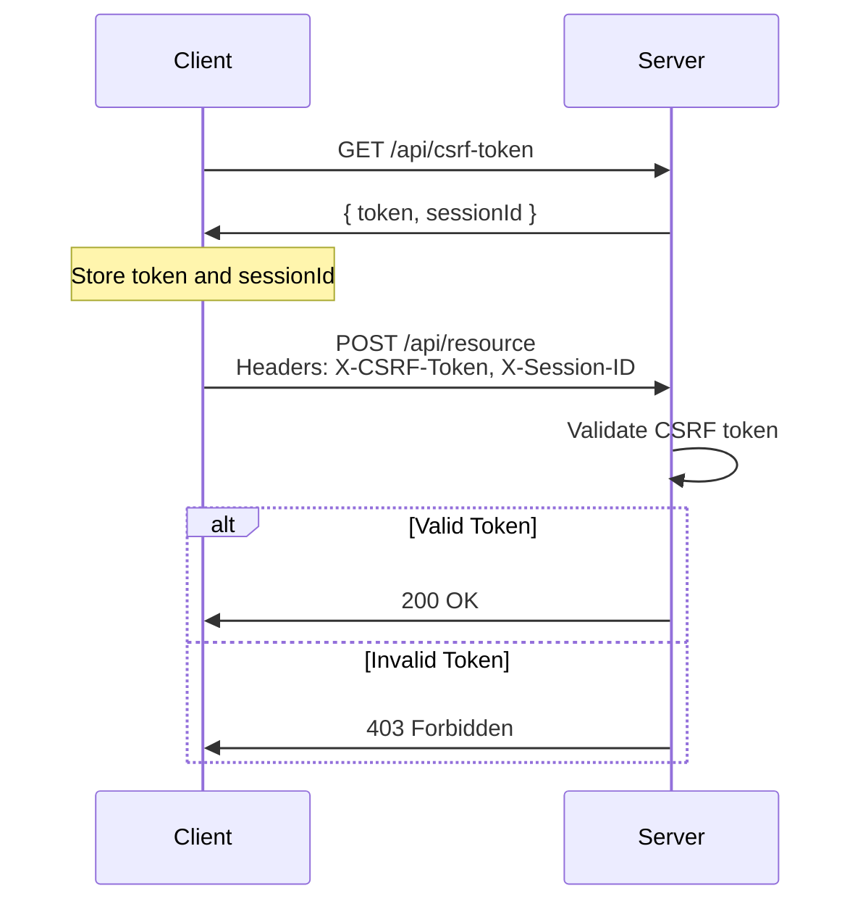

# CORS and CSRF Protection Setup

This document explains the CORS (Cross-Origin Resource Sharing) and CSRF (Cross-Site Request Forgery) protection implemented in the Tikit backend.

## CORS Configuration

### Overview

CORS is configured to allow requests only from whitelisted origins, preventing unauthorized cross-origin requests.

### Allowed Origins

The following origins are whitelisted:

- `http://localhost:3000` - Local development (alternative port)
- `http://localhost:5173` - Local development (Vite default)
- `https://tikit.vercel.app` - Production frontend
- Custom origin from `FRONTEND_URL` environment variable

### Configuration Options

```typescript
{
  origin: function(origin, callback) {
    // Validates origin against whitelist
  },
  credentials: true,           // Allow cookies
  methods: ['GET', 'POST', 'PUT', 'DELETE', 'PATCH', 'OPTIONS'],
  allowedHeaders: ['Content-Type', 'Authorization', 'X-CSRF-Token'],
  exposedHeaders: ['X-CSRF-Token'],
  maxAge: 86400               // 24 hours preflight cache
}
```

### Adding New Origins

To add a new allowed origin:

1. **Development**: Add to the `allowedOrigins` array in `src/index.ts`
2. **Production**: Set the `FRONTEND_URL` environment variable

Example:
```bash
# .env
FRONTEND_URL=https://your-frontend-domain.com
```

## CSRF Protection

### Overview

CSRF protection prevents malicious websites from making unauthorized requests on behalf of authenticated users.

### How It Works

1. **Token Generation**: Client requests a CSRF token from `/api/csrf-token`
2. **Token Storage**: Server stores token with session ID and expiration
3. **Token Validation**: Server validates token on state-changing requests (POST, PUT, DELETE, PATCH)
4. **Token Expiration**: Tokens expire after 1 hour

### Implementation Flow



### Client Implementation

#### Getting a CSRF Token

```typescript
// Fetch CSRF token
const response = await fetch('http://localhost:4000/api/csrf-token');
const { token, sessionId } = await response.json();

// Store for later use
localStorage.setItem('csrfToken', token);
localStorage.setItem('sessionId', sessionId);
```

#### Making Protected Requests

```typescript
// Include CSRF token in headers
const response = await fetch('http://localhost:4000/api/tickets', {
  method: 'POST',
  headers: {
    'Content-Type': 'application/json',
    'X-CSRF-Token': localStorage.getItem('csrfToken'),
    'X-Session-ID': localStorage.getItem('sessionId'),
  },
  body: JSON.stringify(ticketData),
  credentials: 'include', // Include cookies
});
```

### Exempted Endpoints

The following endpoints are exempt from CSRF protection:

- `GET`, `HEAD`, `OPTIONS` requests (safe methods)
- `/health` - Health check endpoint
- `/api/csrf-token` - Token generation endpoint
- `/api/ussd/*` - USSD webhook (external service)

### Token Management

**Token Expiration**: 1 hour

**Automatic Cleanup**: Expired tokens are automatically removed when new tokens are generated

**Token Refresh**: Clients should request a new token if they receive a 403 error with "CSRF token expired"

### Error Responses

| Error | Status | Description |
|-------|--------|-------------|
| CSRF token missing | 403 | Request missing X-CSRF-Token or X-Session-ID header |
| Invalid session | 403 | Session ID not found or invalid |
| CSRF token expired | 403 | Token has expired (> 1 hour old) |
| Invalid CSRF token | 403 | Token doesn't match stored value |

## Security Best Practices

### CORS

1. **Never use `*` wildcard** for allowed origins in production
2. **Always validate origin** against a whitelist
3. **Use credentials: true** only when necessary
4. **Limit allowed methods** to only what's needed
5. **Set appropriate maxAge** for preflight caching

### CSRF

1. **Always validate tokens** on state-changing operations
2. **Use secure, random tokens** (32 bytes minimum)
3. **Set appropriate expiration** (1 hour is recommended)
4. **Clean up expired tokens** regularly
5. **Use HTTPS in production** to prevent token interception

### Additional Recommendations

1. **Rate Limiting**: Implement rate limiting on token generation endpoint
2. **Session Management**: Consider using Redis for token storage in production
3. **Monitoring**: Log CSRF validation failures for security monitoring
4. **HTTPS Only**: Always use HTTPS in production
5. **SameSite Cookies**: Set SameSite=Strict on cookies

## Testing

### Testing CORS

```bash
# Test allowed origin
curl -H "Origin: http://localhost:5173" \
     -H "Access-Control-Request-Method: POST" \
     -X OPTIONS \
     http://localhost:4000/api/tickets

# Test blocked origin
curl -H "Origin: http://malicious-site.com" \
     -H "Access-Control-Request-Method: POST" \
     -X OPTIONS \
     http://localhost:4000/api/tickets
```

### Testing CSRF

```bash
# Get CSRF token
curl http://localhost:4000/api/csrf-token

# Make request with token
curl -X POST http://localhost:4000/api/tickets \
     -H "Content-Type: application/json" \
     -H "X-CSRF-Token: <token>" \
     -H "X-Session-ID: <sessionId>" \
     -d '{"eventId":"123","tierId":"456"}'

# Make request without token (should fail)
curl -X POST http://localhost:4000/api/tickets \
     -H "Content-Type: application/json" \
     -d '{"eventId":"123","tierId":"456"}'
```

## Troubleshooting

### CORS Errors

**Problem**: "No 'Access-Control-Allow-Origin' header is present"

**Solution**:
- Verify the origin is in the whitelist
- Check `FRONTEND_URL` environment variable
- Ensure the request includes the `Origin` header

### CSRF Errors

**Problem**: "CSRF token missing"

**Solution**:
- Ensure client includes `X-CSRF-Token` and `X-Session-ID` headers
- Verify token was obtained from `/api/csrf-token`

**Problem**: "CSRF token expired"

**Solution**:
- Request a new token from `/api/csrf-token`
- Implement automatic token refresh in client

**Problem**: "Invalid CSRF token"

**Solution**:
- Verify token and session ID match
- Check for typos in header names
- Ensure token hasn't been modified

## Production Deployment

### Environment Variables

```bash
# Required
FRONTEND_URL=https://your-production-domain.com
NODE_ENV=production

# Optional (for additional origins)
ADDITIONAL_ORIGINS=https://app.example.com,https://admin.example.com
```

### Checklist

- [ ] Set `FRONTEND_URL` to production domain
- [ ] Enable HTTPS
- [ ] Configure SameSite cookies
- [ ] Set up rate limiting
- [ ] Enable security headers (Helmet.js)
- [ ] Monitor CSRF failures
- [ ] Test CORS from production domain
- [ ] Document allowed origins for team

## References

- [OWASP CORS Cheat Sheet](https://cheatsheetseries.owasp.org/cheatsheets/Cross-Origin_Resource_Sharing_Cheat_Sheet.html)
- [OWASP CSRF Prevention Cheat Sheet](https://cheatsheetseries.owasp.org/cheatsheets/Cross-Site_Request_Forgery_Prevention_Cheat_Sheet.html)
- [MDN CORS Documentation](https://developer.mozilla.org/en-US/docs/Web/HTTP/CORS)

